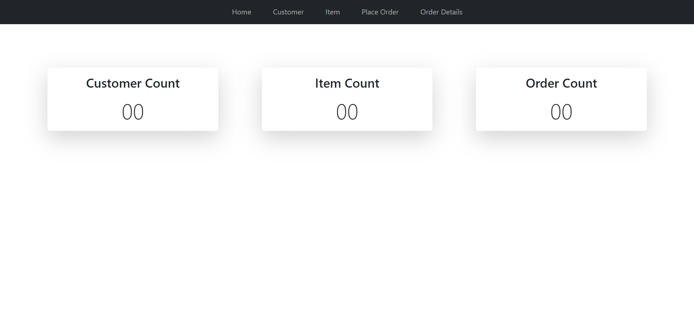
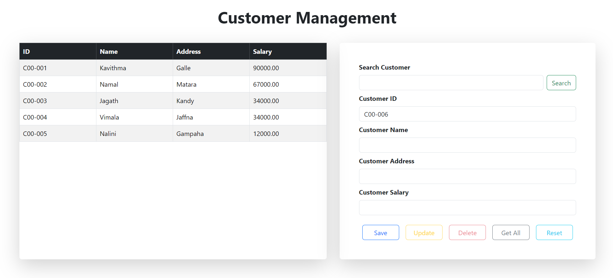
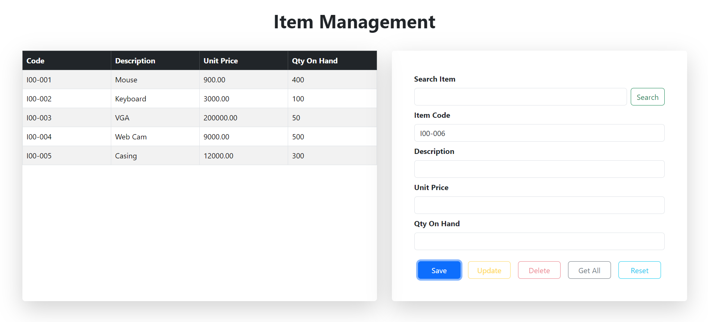
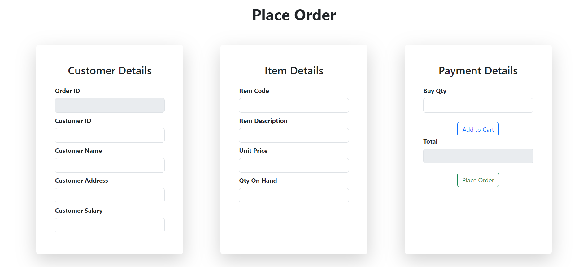
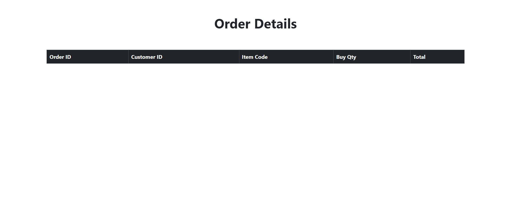

# 🌟 Simple POS - Laravel 🌟

The Simple POS project is a robust and efficient system designed to support a Point of Sale (POS) application. Built
with the Laravel framework, this project provides essential functionalities for managing customers, item details, and
order processing, with both frontend and backend components.

## 🛠️ Tech Stack

### 🔥 FrontEnd

✅ **HTML** 
✅ **CSS** 
✅ **JS** 
✅ **AJAX** 
✅ **JQuery** 
✅ **Bootstrap** 
✅ **Blades** 

### 🔥 BackEnd

✅ **Laravel** 
✅ **MySQL** 

## 🚀 Features

✅ Manage Customers 
✅ Manage Items 
✅ Place Orders 
✅ View Order Details 

## 📸 Screenshots

### Dashboard

### Customer Management

### Item Management

### Place Order

### Order Details

## 📝 Version

**1.0.0**

## 📬 Get in Touch

If you encounter any issues, have questions, or need assistance with the code, feel free to reach out!

📧 [kavithmathushal9007@gmail.com](mailto:kavithmathushal9007@gmail.com)

#### This project is licensed under the [GNU License](LICENSE)

#### © 2024 All Rights Reserved | Designed by [Kavithma Thushal](https://github.com/Kavithma-Thushal)

